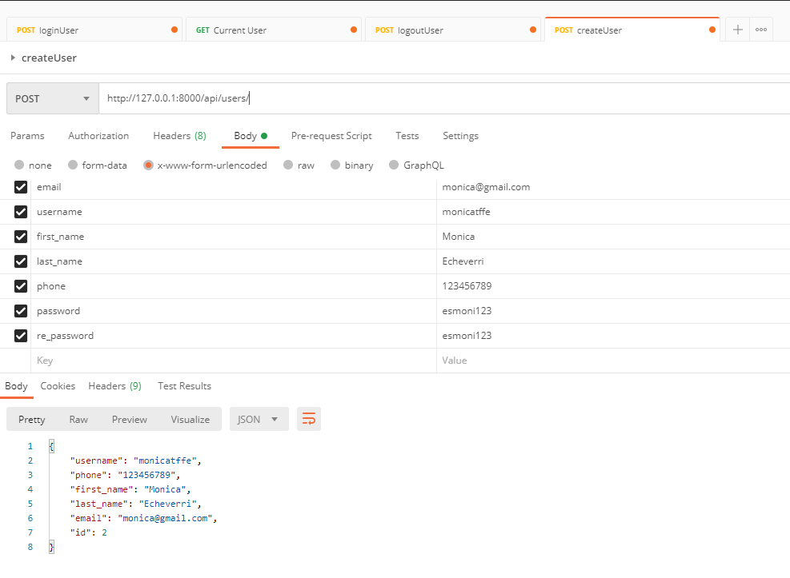
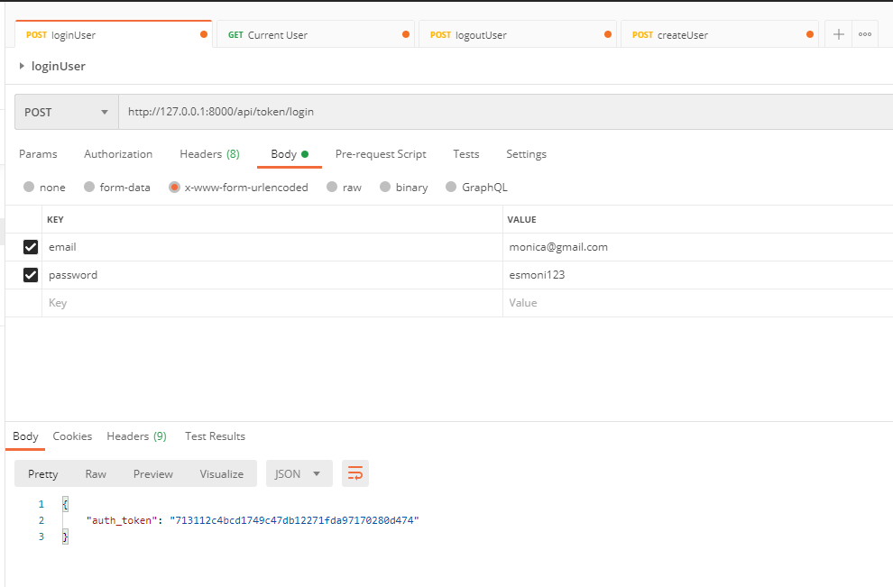
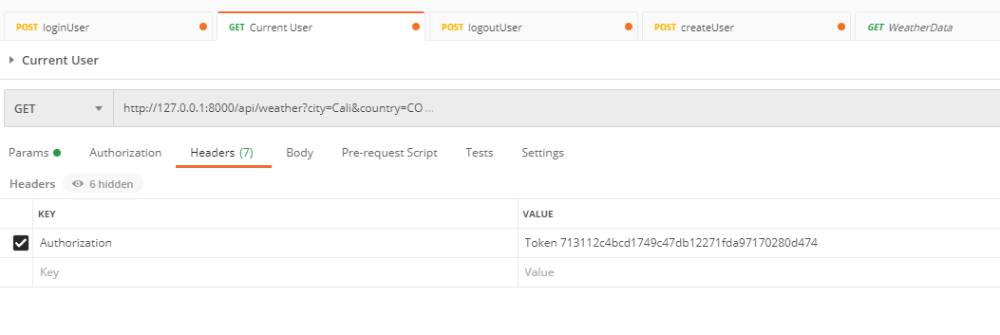
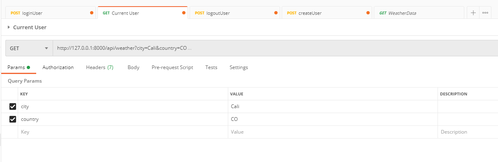
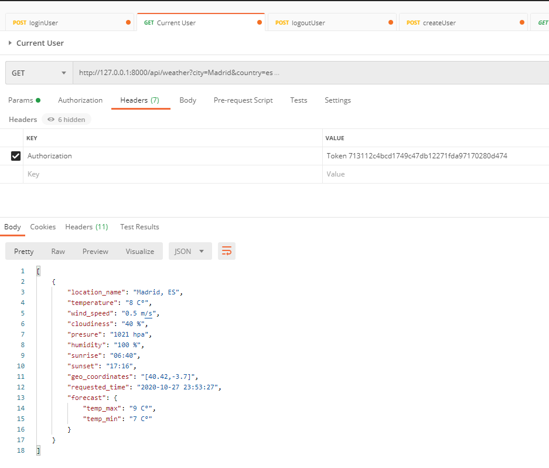
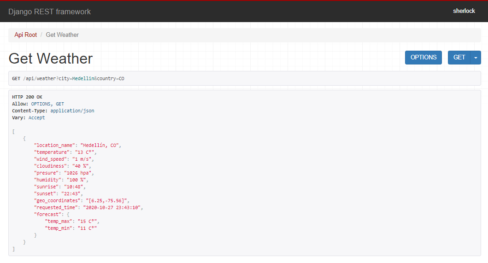

# WeatherApi - Technical Test

Weather API is a REST API service that allows us to know the weather of more than 200,000 cities around the world thanks to its integration with the OpenWeatherMap API, what are you waiting to test it?

## Table of Contents

Table of Contents
  * [Quick Install](#quick-install)
    + [Setting up a virtual environment](#setting-up-a-virtual-environment)
    + [Install packages](#install-packages)
    + [Run project](#run-project)
  * [Authentication in Postman](#authentication-in-postman)
  * [Response Example](#response-example)
  * [Postman Test](#postman-test)
  * [API View Test](#api-view-test)
  * [Some technologies used](#some-technologies-used)
    + [Django REST Framework](#django-rest-framework)
      - [To install Django REST framework](#to-install-django-rest-framework)
    + [OpenWeatherMap API](#openweathermap-api)
      - [To install requests](#to-install-requests)
      - [To use requests](#to-use-requests)
  * [Contributing](#contributing)
  * [Author](#author)

## Quick Install

### Setting up a virtual environment

Install virtualenv with the following command:

```bash
pip install virtualenv
```

To create a virtual environment for your project, open a new command prompt, navigate to the folder where you want to create your project and then enter the following:

```bash
py -m venv project-name
```
To activate the environment, run:
```bash
project-name\Scripts\activate.bat
```

### Install packages

Use the package manager [pip](https://pip.pypa.io/en/stable/) to install the requirements file.

```bash
pip install requirements.txt
```

### Run project

To deploy the application, run:

```bash
python manage.py runserver
```

Finally, you should see something like this on your console:

```bash
System check identified no issues (0 silenced).
October 27, 2020 - 22:35:11
Django version 3.1.2, using settings 'technicalTest.settings.dev'
Starting development server at http://127.0.0.1:8000/
Quit the server with CTRL-BREAK.
```

## Authentication in Postman

Creating a user:   



Login and generate a Token API:   



Set Token in headers:   



Set params:   



Get the data:   




## Response Example

This is an example of what the API returns when used:

```json
[
    {
        "location_name": "Bello, CO",
        "temperature": "13 C°",
        "wind_speed": "1 m/s",
        "cloudiness": "40 %",
        "presure": "1026 hpa",
        "humidity": "100 %",
        "sunrise": "10:48",
        "sunset": "22:43",
        "geo_coordinates": "[6.34,-75.56]",
        "requested_time": "2020-10-27 22:29:11",
        "forecast": {
            "temp_max": "15 C°",
            "temp_min": "12 C°"
        }
    }
]
```


## Postman Test   


## API View Test   



## Some technologies used

### Django REST Framework

Django REST framework is a powerful and flexible toolkit for building Web APIs.

#### To install Django REST framework
Install using `pip`...

    pip install djangorestframework

Add `'rest_framework'` to your `INSTALLED_APPS` setting.

    INSTALLED_APPS = [
        ...
        'rest_framework',
    ]

Full documentation for the project is available at [docs](https://www.django-rest-framework.org/).


### OpenWeatherMap API

The [OpenWeatherMap](http://openweathermap.org) service provides open weather data for more than 200,000 cities and any geo location that is available on their website and through their API.

Using their service requires registration where you can get your API key.

[Get your API key (APPID) here](http://openweathermap.org/appid)

The above script requires `requests`

#### To install requests

```shell
$ apt-get install python-pip
$ pip install requests
```

#### To use requests

```python
import request

api_data = config('API_DATA').format(city,country)
response = requests.get(api_data)
content = response.json()
```

## Contributing
Pull requests are welcome. For major changes, please open an issue first to discuss what you would like to change.

Please make sure to update tests as appropriate.

## Author

| **Name**     | Alex Steven Nieto Arboleda |
| ------------ | --------------------------------- |
| **Contact** | alsteven.nietoar@gmail.com     |
